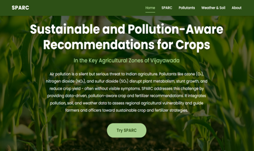
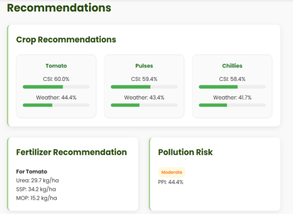
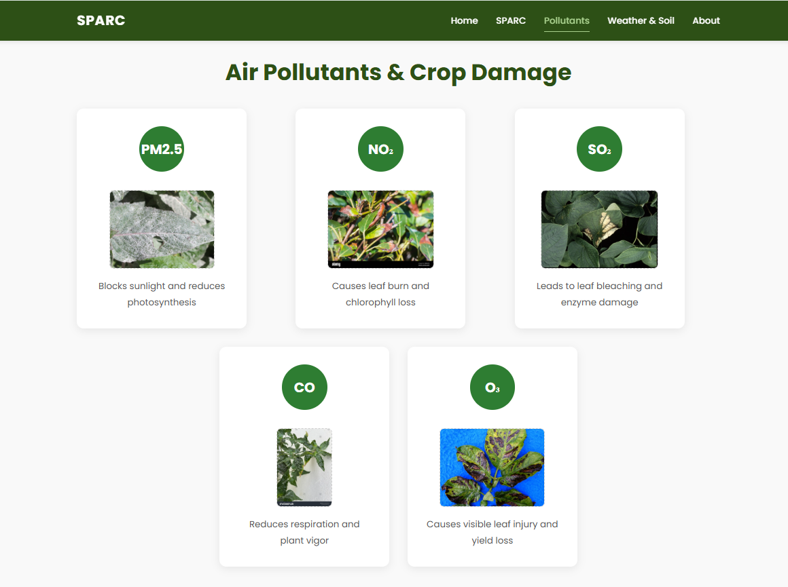
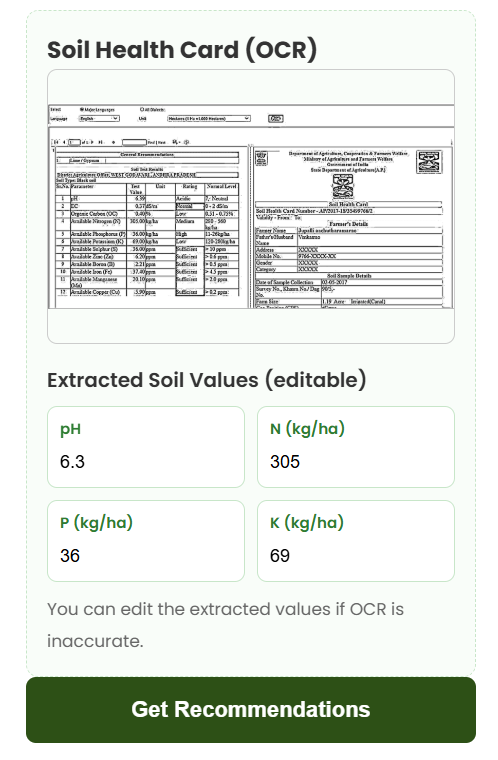

# SPARC – Pollution-Aware Crop Recommendation System

## Overview
SPARC (Sustainable and Pollution-Aware Recommendations for Crops) is a decision-support system that recommends suitable crops  using **weather, soil conditions, and air pollution data**.

The system is designed for five key agricultural zones in Vijayawada (Andhra Pradesh, India):
**Ganguru, Poranki, Kanuru, Tadigadapa, and Penamaluru**, and provides **season-wise recommendations** (Kharif, Rabi, Summer) to support sustainable and informed farming decisions.

---

## Problem
Crop planning in many regions is based on **traditional practices or isolated data sources** such as weather or soil reports.

However, in reality:
- Crop growth is influenced by **combined environmental factors** (weather, soil nutrients, and air pollution)  
- Air pollutants (PM2.5, NO₂, SO₂, O₃, CO) negatively impact crop health and yield  
- Existing advisory systems do not integrate these factors into a **single decision framework**  
- Farmers lack **zone-specific, season-aware guidance** that reflects real environmental conditions  

This results in suboptimal crop selection and inefficient fertilizer usage.

---

## Methodology

The system integrates environmental factors into a unified decision model:

- Weather suitability (temperature and rainfall)  
- Soil nutrient analysis (N, P, K, pH)  
- Pollution impact using normalized pollutant levels  

A **Crop Suitability Index (CSI)** is computed using weighted parameters, along with a **Pollution Pressure Index (PPI)** to adjust recommendations.

---

## Key Features
- Pollution-aware crop recommendation system  
- Season-wise suggestions (Kharif, Rabi, Summer)  
- Zone-specific analysis for Vijayawada regions  
- OCR-based Soil Health Card input for personalized recommendations  

---

## Tech Stack
- Python  
- Web Technologies (Frontend + Backend)  
- OCR (Soil Health Card processing)  
- Weather & Air Quality APIs  

---

## Outcome
- Generated crop suitability scores using environmental data  
- Built a unified system combining **weather, soil, and pollution insights**  
- Delivered an interactive platform for agricultural decision support  

---

## Prototype

---

## Key Takeaway
This project demonstrates how **integrating environmental intelligence into agriculture** can improve crop planning, and support sustainable farming practices.

---
